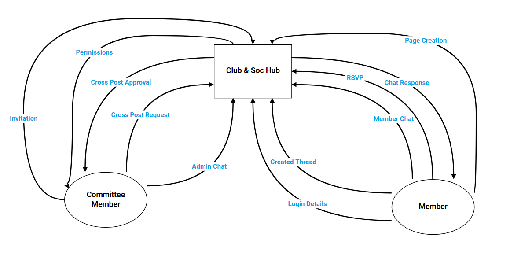
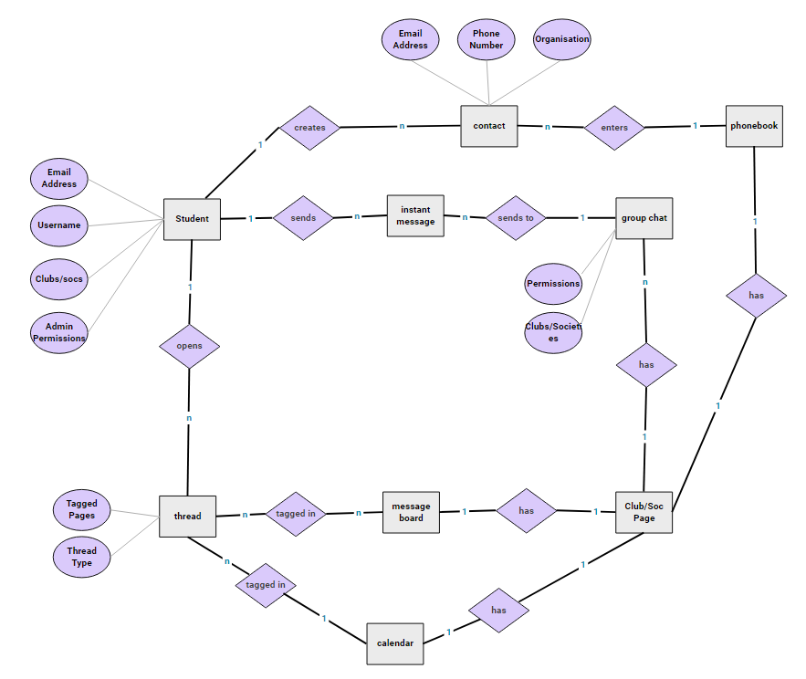
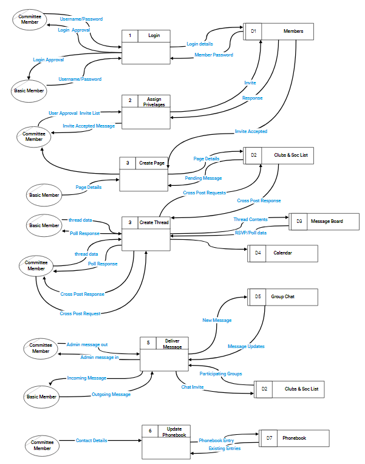

Page Content

**1. Introduction**
1.1 Overview									1
1.2 Glossary									1
**2. General Description**
2.1 Product/System Functions					2
2.2 User Characteristics and Objectives			3
2.3 Operational Scenarios						4
2.4 Constraints								6
**3. Functional Requirements**
3.1 User Registration/Login					7
3.2 Using the forum page for regular users		7
3.3 Using the forum page for administrative		8
​    users
3.4 Real-time Chat Application					9
3.5 Society Event Functionality					9
3.6 Calendar									10
**4. System Architecture**
System Architecture Diagram					11
**5. High-Level Diagrams**
A Context Diagram							12
A Data Flow Diagram							13
An Entity Relationship Diagram					14
**6. Preliminary Schedule**
Preliminary Schedule Diagram					15

___

# 1. Introduction

**1.1 Overview**
PASII is a suite of web tools which will allow seamless communication and
organisation among committee members and regular members. It aims to make organising
events, and managing/registering new students a quick and simple process. It will
encourage inter-society communication, and make contacting outside universities and
organisations simple. We are aiming for a high adoption rate among students by offering a
vibrant and responsive UI with a simple and navigable design.
From our research we have determined the features we plan on implementing are
extremely appealing to our target audience. Currently, DCU Club and Soc members are
required to use a variety of different applications to carry out their administration tasks.
This project aims to solve that problem.
**1.2 Glossary**
_HTML:_  Short for Hypertext Markup Language. Used for website creation.
_MEAN: Short for MongoDB, Express.js, Angular, and Node.js.
MongoDB:_  A non-relational database.
_Node.js:_ A JavaScript runtime environment.
_Express.js:_ A JavaScript framework used for building APIs
_Angular:_ A front-end web application framework.
_JavaScript:_  A core technology of websites. It is a dynamic, interpreted programming language.
_TypeScript:_  A syntactical subset of JavaScript for large scale web applications.
_Socket.io:_ A JavaScript library for real-time web applications.

# 2. General Description

**2.1 Product / System Functions**
Below is a general overview of the functions that we are planning to implement.
These functions will be explained with more detail in section three.
● Registering as a user
● Sign in
● Editing User Profile
● Creating a Club or Society
● Editing Club or Society profile
● Granting Administrative Permissions
● Registering Users with your club or society
● Opening a message board thread
● Making an announcement
● Adding to phonebook
● Private messaging another user
● Private messaging another society
● Creating Event
● RSVP to an event
● Event Calendar for future events
● DCU wide event calendar for displaying all public events
● Adding Club or Soc. Contacts
● Live Chat
● Admin Chat
● Cross posting to another society
● Approving a cross post
● Messaging Other Societies
● General Club and Soc information for new students

**2.2 User Characteristics and Objectives**
There will be two main user types defined on our system. Basic members and
administrative members. The administrative members will have elevated permissions that
allow them to make changes to their club and society pages. These admins will typically be
Club & Soc committee members. They can grant administrative permissions to other
members of the committee. Given that our goal of making a simple UI that highlights an
easily navigable user interface, we will not be requiring our users to have any IT skills
beyond basic functions such as browsing the internet, using an online forum, creating a
user profile and creating RSVP forms.
From conducting research into possible user requirements we discovered that there
was a strong desire for a unified application that consolidates every element of committee
administration into single platform. We found that nearly every respondent said that their
committee uses a variety of different applications such as Facebook, Whatsapp, Google
suite, Slack and some sort of event RSVP website such as Doodle.com. This has prompted us
to investigate the possibility of implementing live online chat rooms for each society. Each
society’s chat room should also have an option to chat exclusively among committee
members.
The majority of the potential administrative users that we contacted said that they
are involved in organising inter society events. Our plan to implement an inter society
messaging system and also allowing committee members to post committee approved
threads on other societies message boards. The majority of potential basic members and
admin. Members that we questioned said that they were members of multiple societies. A
small amount of committee members said that they were on the committee of more than
one club or society.
This again highlighted the need for easy inter society communication.
Many Clubs and Societies have their own method of registering new members. Many have a
system where the prospective members write down their name and email address on a
registration sheet on DCU’s Club and Soc. Registration Day. They then manually enter all of
this data into whatever membership management system they are using. When we asked
users whether they would like a ubiquitous method that makes the registration process
simple the answer was a resounding yes with 93% of respondents in favour of the idea.
When we asked committee members if they have any contact with outside
organisations (e.g. charities, government organisations) 37.5% or responses said that they
do. 50% of committee members said that they communicate with clubs and societies from
other universities. Because of this we are planning on implementing a phonebook feature
that allows users to store the phone numbers, email addresses and the names of the
organisations that they work with.
We asked the committee members if they would be interested in a bulletin
board/blog style application that they could use to make announcements. 50% of
respondents replied ‘yes’ and ‘50%’ replied maybe. Because of this we are hoping to

implement a message board that allows admins to pin important announcements or events
so they will appear first in the message board’s list of threads.
**2.3 Operational Scenarios
Non-Member Browsing Website**
A user that has not yet registered may browse the website. The user opens the
website and is shown the homepage. The user has the option to register and create an
account. The user can see the DCU wide event calendar, browse club and soc. message
boards, look at public user profiles of other users, look at a club or soc profile page and also
view informational pages on the website such as “How to Start a Club or Soc”. Private
events, threads and live chat are hidden from the user.
**Creating an account**
When a user that is not logged in, a “Sign Up” button is displayed on the nav-bar.
The user follows this link and is asked to enter the email address, username and passwords
they wish to associate with the account. The password must be entered twice to ensure that
the user has not accidentally misspelled their password. Once this user has entered this data
they can proceed to the next stage of registration. The user will then be given the option to
upload a profile picture, add a bio, display the course they are currently enrolled in. Then
the user will be shown a list of clubs and socs that have a page on the website. They can
select all the societies that they are a member of or ones that they intend on joining. Once
they confirm these selections, the user will need to wait for a committee member of that
society to confirm their membership before the societies they selected are displayed on
their profile page.
**Creating a Club or Society Page**
A user that is signed in may create a page for their club or society. The user navigates
their way to the “Create a Club or Society” page. The user will be asked to provide a name
for their page. The user can then optionally add a profile picture, a banner and a bio for
their page. The user will then be prompted to add members to their society. The can search
the names of their existing members if they have signed up for the website. In order for the
page to activate they must have 10 confirmed members. This is a measure to stop the
creation of clubs or societies that have not been approved by DCU. Such pages will be
marked as “Pending” and can only be seen by members that have been invited. The user can
also choose to elevate the permissions invited members to admin status if they are a
member of the committee. The user will be able to select the individual permissions for
each member. For example, they do not have to allow other admins the ability to edit the
bio of the club or society. The invited user can choose to be placed on the email list of that
page.

**Posting a Thread on a Message Board**
A user that is a member of a club or society page can post announcements to their
message board. After the user has navigated to the message board of their club or society,
they can choose to create a thread. When creating a thread they will have a variety of
posting options depending on whether they have admin permissions on that page. They can
choose to make the post an announcement, in which case any user that has selected to be
on the mailing list of that page will receive an email with the contents of that post. If the
user is an admin they can choose to ‘pin’ a thread. Posts that are pinned will remain as
threads that are displayed at the top of the message board until they are unpinned by an
admin member. Admins can also create event threads. Event threads will be displayed in the
message board and automatically pinned until the day of the event. If the event is a public
event, the event will be added to the DCU wide event calendar and the event section on
their page. Otherwise the post will only be visible to members of that club or society. Basic
club and soc members can create threads that contain images, text and polls. Admins also
have the option to “Cross Post”. They can tag other clubs and societies in their
announcements, events and basic threads. When another page is tagged in a thread, their
admins will be prompted to either accept or reject the cross post. If the thread is accepted
then they can choose to send the thread to all the members on their email mailing list and
pin the thread. If the cross post is a poll or event, only clubs and socs that are tagged in that
thread can vote or RSVP to that thread.
**Adding to a Phonebook**
Admin users with sufficient privileges can choose to add contacts to the ‘phonebook’
of their Club or Soc. Here they can choose to add the contact information of organisations
outside of DCU. For phonebook each entry, the club will be able to add the name of the
organisation, multiple phone numbers and email addresses, a description of the nature of
their relationship with that organisation and a symbol or logo that represents that
organisation. The phonebook can then be accessed by any member of the committee.
**Notifications**
Each user will have a notification page that can be accessed through their navbar.
Users will receive notifications when someone has responded to their thread or comment or
when they are invited to a club or society. If the user is an admin with sufficient admin
permissions then they may receive notifications regarding members attempting to join their
club or society and other clubs or societies that are requesting to make a cross post on the
page that they are an admin of.

**2.4 Constraints**
_UI:_ The user interface will have to be accessible for users of all abilities and backgrounds, it must also
be bulletproof, as different users will have different permissions and we must create specific
interfaces for each type of user.
_Run User Tests:_ Ensuring that the user has a smooth and useful experience is core to our product,
and we will have to test many scenarios for each type of user.
_Real Time Chat:_ The chat will be the only real-time aspect of our project, and we expect it to be able
to handle large amounts of traffic in many different environments, this will be one of our main areas
of focus.

# 3. Functional Requirements

3.1  **User Registration/Login**
_Description_
The system must store all usernames, passwords, and other associated data for
identification purposes and for things such as profile pages. It will be necessary to store this
data in a database as a way of determining which user does what.
_Criticality_
This registration and login system is essential for the functionality of the application.
It will help everyone to determine who is doing what, and primarily help the application
itself at determining how to interact with user inputs as well as recording all of the data. The
style of the app is forum based, we found this fitting as 100% of respondents used Facebook
(and Messenger) for correspondence and 81% used email; this blend of tools seemed to
correlate with the functionality of a forum style site with a chat aspect (37.5% used
WhatsApp).
_Technical Issues_
The first issue would be ensuring that all of the user data is stored in the database
correctly, this includes hashing passwords, and ensuring there are no duplicates of
usernames. Another important issue to be aware of would be passing that data from the
database to the front end, without this, there is no usability.
_Dependability with other requirements_
This is the first page any user will see when they first enter the website. It is their
entry point for the rest of the site. When a user does anything on the site, their login
credentials will be used to keep a record of all of their activity.
3.2  **Using the forum pages for regular users**
_Description_
Regular users do not have full functionality. They may read posts on their relevant
threads, and submit new posts as well. Here they will interact with other users on the
service, commenting, sharing, and communicating with them. As a requirement the user
should see any updates to this upon refreshing the page, and should be able to interact with
the forums at a very high level.
_Criticality_
It is paramount to have this functioning correctly, a user must be able to interact
with the forums at all times otherwise there is no application to interact with. The database

will need to be updated upon any submission of posts or comments, and pass this to the
front-end for displaying back to the users.
With 47.4% of poll respondents giving feedback of 4 and over out of 5, and 42.1%
ranking a 3 out of 5, we found this to be a sufficiently positive response to go ahead with a
forum as the meat of the project.
_Technical issues_
This will be achieved by ensuring the user interface is high level enough that users of
all demographics will find it easy to use. We can take inspiration from larger known websites
that do similar jobs. Testing will play be of utmost importance here, ensuring that all use
cases are bulletproof, and everything is working as it should be.
_Dependencies with other requirements_
For this to run smoothly, the front-end and the database must be able to
communicate seamlessly. In addition to this, the user interface must be easy to use for the
members as it is the entirety of the application from their perspective.
3.3  **Using the forum pages for administrative members**
_Description_
Admin members have all the permissions of a regular user, with some extra
functionality as well. Admins will be assigned on a per forum basis. For example an admin on
the Redbrick page, may not necessarily have admin privileges on the Esoc page. These
privileges will include things such as pinning posts to the top of forums, moderating user
activity, and adding new members to forums.
_Criticality_
Given that there will be far fewer admins than regular users, it takes lower
precedence, yet it is still vital for the functionality of the site. It will add more flavour to the
site, help maintain order, and admins will also be there to assist members in matters
relating to their forums.
With 75.1% of committee member respondents to our polls sent out given positive
feedback for this feature (4+ out of 5), we found this to be a crucial aspect, and perhaps
even a focus of the app.
_Technical issues_
The above can be accomplished similarly to  _3.2_ , the difference being that these users
will be marked as admins in their data stored in the database, opening up more options to
them in the user interface.

_Dependencies with other requirements_
The dependencies for this mirror the dependencies for  _3.2_ ; with the addition of
more user interface options, and an extra field in the database entries.
3.4  **Real-time chat application**
_Description_
The chat segment of the service will be a drop down box in the corner of the street,
it will be relevant to the current page that the user is on. There will be seperate tabs for
general users and the admins of the page, along with a tab for upcoming events. It will be in
real-time, with message time stamps and sender usernames.
_Criticality_
Given our feedback from the polls we sent out, 37.5% of respondents (at a minimum,
as Messenger was grouped together with Facebook, which scored at 100%) reported using
WhatsApp as an organisational tool used in their societies. We found this to be a useful
feature to round off our application, as it adds functionality and responsiveness that would
be otherwise lacking.
_Technical issues_
For this we will be using event driven technology to interact between the server and
the client, the main concern will be response time and concurrency. Ensuring everyone gets
their messages on time and with no errors.
_Dependencies with other requirements_
This will of course have to tie in with user privileges, to know which users may
communicate in what groups. It also requires knowledge of what page the user is viewing,
this will be getting this knowledge from the front-end, and then passing the correct data
from the back-end to the front-end chat client. On top of this, it will also link in with the
events feature (outlined in  _3.5_ ) for the event chat section.
3.5  **Society Event Functionality**
_Description_
Events feature in several aspects of the application, The most poignant of which
being the Events page. This will detail all of the events relative to the user viewing them. It
will also be pertinent in the chat feature mentioned above, allowing the user to interact
with other users who the event is relative to. Events will be a special type of post on forums,
and will also be appended to the calendar feature outlined in  _3.6_ .

_Criticality_
This feature is not a necessity, yet it was a highly requested feature, with 62.5% of
respondents organising events with outside bodies to DCU and 81.3% organising
inter-society events. Apart from this, all societies responded with having internal events at
some point. This lead us to believe that having specific functionality for events was a great
addition to the system.
_Technical issues_
This seems relatively tricky when compared to previous sections, this is due to how
intertwined with all of the other features it is. It makes appearances in everything from
forum posts, to chat groups. Implementation will include using a flag so that the system
knows it is an event, and will deal with it appropriately in the front end, whether it be
special formatting for a post on the forums, to being visible in a slot on the calendar.
_Dependencies with other requirements_
Events depend on all other aspects of the system, as mentioned above they will be
present in their own page, s an option in the chat room, and at the top of forum pages. They
will depend on knowing what user is viewing them, and what page the user is currently on.
3.6  **Calendar**
_Description_
The calendar is available on the events page. It is only a small subsection but it is a
great quality of life addition that seemed interesting to some of those we interviewed, and
does not require much extra effort for the functionality it provides.
_Criticality_
This feature is not critical by any means, it is simply an organisational tool that would
be simple to implement and useful for the user.
_Technical issues_
The calendar will be passed information from the database relating to events, similar
to the events it will only display data relevant to the user viewing it. It will take the time and
date data and display it in the appropriate calendar slot with relevant information about the
event.
_Dependencies with other requirements_
This system will be entirely dependant on the events system outlined in  _3.5_ . It will
get all of its inputs from the database entries relevant to the events, and even display its
data in the same page as the Events.

# 4. System Architecture

# 5. High-Level Design

In this section we will show a basic high level design of our project using the following:
● A Context Diagram
● A Data Flow Diagram
● An Entity Relationship Diagram
**Context Diagram** 

**Entity Relationship Diagram**

**Data Flow Diagram**

# 6. Preliminary Schedule

Below is a Gantt chart that displays our projected schedule for the execution of our project.

